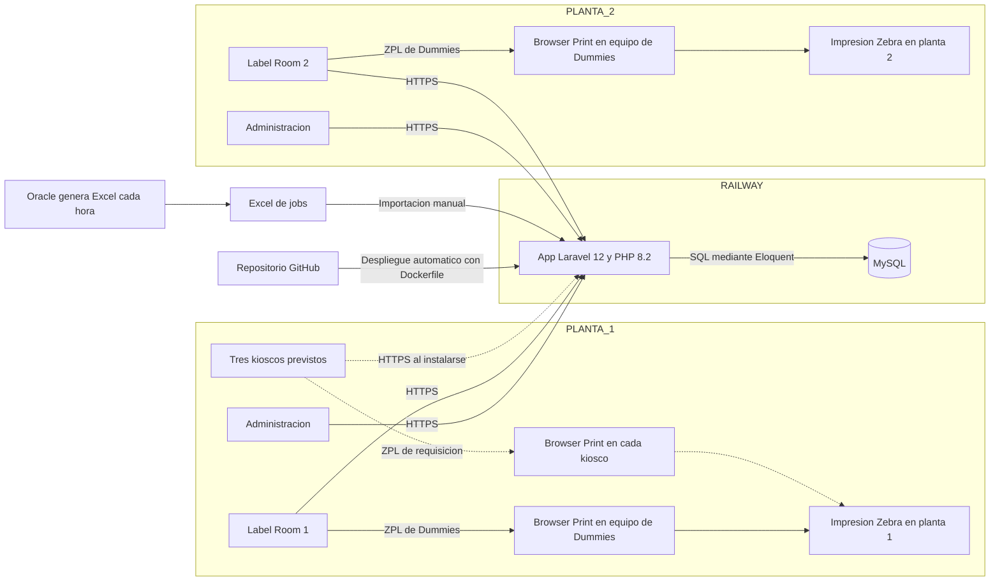
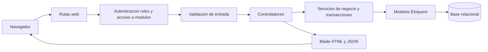
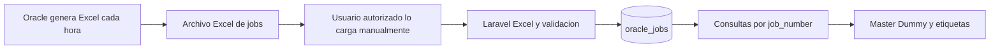
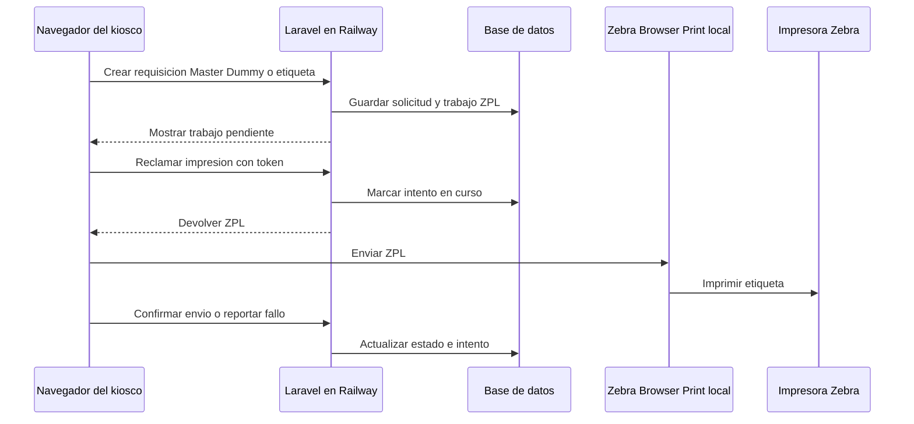

# Arquitectura de la aplicación y flujo de datos

**Sistema:** Label Control System.

**Referencia:** código del repositorio y descripción del entorno proporcionada por el responsable del sistema el 18 de septiembre de 2026. No se consultó el panel de Railway ni se verificaron sus variables de entorno.

**Alcance:** componentes de la aplicación, fronteras entre planta y nube, recorrido de los datos y persistencia. Para tablas, columnas y llaves foráneas, consultar el [modelo de base de datos](database-schema.md).

## Vista de despliegue y conexiones

**Lectura del diagrama:** según la configuración descrita, Railway tiene **dos servicios: App y MySQL**. Administración puede acceder desde ambas plantas; hay un Label Room en cada una. Los tres kioscos de Planta 1 están **planeados**, por eso sus conexiones se dibujan punteadas. Browser Print se requiere en los kioscos y en los equipos de Label Room que imprimen Dummies. El dibujo no fija si cada impresora usa USB o red, ni cuántas impresoras hay: eso todavía no se confirmó. Oracle genera un Excel cada hora, pero el ingreso de jobs a esta aplicación sigue siendo manual.

## Componentes y responsabilidades

| Componente | Ubicación lógica | Responsabilidad y evidencia |
| --- | --- | --- |
| Navegadores de administración y Label Room | Plantas 1 y 2; un Label Room por planta | Formularios, revisión, importación y operaciones de producción. Las pantallas se sirven con Blade y JavaScript; ver [`routes/web.php`](../routes/web.php) y [`resources/views`](../resources/views). |
| Kiosco | Tres estaciones planeadas en Planta 1 | Registro de perfil, sesión propia, alta de requisiciones Master, Dummy y etiquetas estándar/LPK; ver rutas `/kiosk` en [`routes/web.php`](../routes/web.php). |
| Servicio web Laravel | Servicio **App** en Railway | Recibe peticiones, aplica middleware, valida formularios, ejecuta servicios de negocio y entrega HTML o JSON. El [`Dockerfile`](../Dockerfile) define PHP 8.2, `pdo_mysql` y un proceso `php artisan serve` en `${PORT:-8080}`. |
| Frontend | Compilado dentro de la imagen de la aplicación | Blade, JavaScript, Tailwind y Vite. La etapa de Node compila `public/build`; ver [`vite.config.js`](../vite.config.js). |
| Base relacional | Servicio **MySQL** en Railway | Solicitudes, catálogos, seriales, lotes, usuarios y bitácoras. La aplicación se conecta con parámetros `DB_*` o `DB_URL`; ver [`config/database.php`](../config/database.php). |
| Zebra Browser Print e impresora | Kioscos de Planta 1 y equipos de Label Room que imprimen Dummies | El navegador descubre la impresora y le envía ZPL. El servidor guarda y entrega el ZPL de la etiqueta de requisición, pero el envío físico ocurre desde el equipo de planta; ver [`kiosk-dashboard.js`](../resources/js/pages/kiosk-dashboard.js). |
| Archivo Excel de Oracle Jobs | Generado por Oracle cada hora; cargado manualmente en la app | La importación actualiza `oracle_jobs` por `job_number`; ver [`OracleJobService.php`](../app/Services/Oracle/OracleJobService.php). El repositorio no contiene un conector Oracle en línea. |

## Despliegue actual en Railway

1. Un cambio llega al repositorio de GitHub y Railway inicia el despliegue automático de **App** usando el [`Dockerfile`](../Dockerfile).
2. El Dockerfile compila los recursos con Vite, instala las dependencias PHP y prepara la imagen que inicia Laravel.
3. Railway ejecuta el **Pre-Deploy Command** `php artisan migrate --force --no-interaction` contra su servicio **MySQL**.
4. Al iniciar, el contenedor ejecuta `package:discover`, `config:cache`, `view:cache` y `php artisan serve` en `${PORT:-8080}`. La ruta `/up` está configurada en [`bootstrap/app.php`](../bootstrap/app.php).

Los pasos 1 y 3 describen la configuración indicada por el responsable; el repositorio por sí solo no contiene la configuración del panel de Railway. El comando de migración se ejecuta antes de activar la nueva versión, no dentro del `CMD` del Dockerfile.

## Organización interna de Laravel

Flujo habitual de una operación de negocio:

- **Entradas HTTP:** [`routes/web.php`](../routes/web.php) contiene las rutas de administración, Label Room y kiosco. [`bootstrap/app.php`](../bootstrap/app.php) registra `auth`, sesión de kiosco, rol, usuario activo y permiso de módulo; también define `/up` como ruta de salud.
- **Validación:** las clases de [`app/Http/Requests`](../app/Http/Requests) y la validación en los controladores comprueban las entradas de sus respectivas operaciones.
- **Lógica de negocio:** [`app/Services`](../app/Services) separa Oracle, Master, Dummies, etiquetas, kiosco, catálogos, acceso y dashboard. Las operaciones que crean o reservan varios registros usan transacciones en los servicios correspondientes.
- **Persistencia:** [`app/Models`](../app/Models) representa las entidades; [`database/migrations`](../database/migrations) define la estructura física.
- **Respuesta:** los controladores entregan vistas Blade, redirecciones o JSON para consultas e impresión. No se encontró un archivo de rutas `api.php` en este repositorio.

## Recorrido de los datos

### 1. Importación de Oracle y catálogos

Oracle genera un Excel de jobs **cada hora**. Un usuario autorizado lo carga en la aplicación; no se indicó que cada archivo generado se importe en esa misma hora. `OracleJobService::importFromExcel` normaliza las filas y crea o actualiza registros de `oracle_jobs` dentro de una transacción. Master, Dummy y etiquetas consultan ese catálogo local al validar y llenar requisiciones. También hay importaciones Excel para `master_model_mappings` y `rating_assembly_mappings`. **La actualización de Oracle Jobs depende de una carga manual; el código revisado no programa una sincronización automática.**

**Evolución prevista:** conectar la aplicación a una base fuente de jobs para consultarlos sin exportar e importar Excel. Esa conexión todavía no existe. No están definidos en esta documentación el motor de la base fuente, el mecanismo de acceso, la frecuencia de actualización ni cómo se resolverán cambios o bajas de jobs; por eso no se dibuja como una conexión activa.

### 2. Requisiciones y trabajo de Label Room

| Flujo | Datos que recibe | Datos que guarda o consulta |
| --- | --- | --- |
| Master | Job, línea, turno, folios y contexto de producción | `oracle_jobs`, `master_requests`, `master_request_folios`; al imprimir, `master_print_batches` y `master_request_batch_items`. Un rework crea una nueva fila de `master_requests` relacionada con la solicitud raíz. |
| Dummy QR | Job, rango y tipo RMT/RW | `dummy_requests`, `dummy_request_items`, `dummy_print_batches` y `dummy_print_batch_items`. |
| Etiquetas estándar y LPK | Job, NP, cantidades, grupos y datos de envío | `label_requests` y sus renglones estándar o grupos/items LPK. Label Room libera la solicitud y registra `label_work_tasks`, `serial_ranges` y `label_administration_events`. |
| Catálogos e impresión de etiquetas | SKU, mercado, plantilla y perfil | `label_skus`, `sku_serial_formats` y variantes UL/EMEA/ANZ, `label_templates`, `label_print_profiles` y versiones. Las tablas de serialización e impresión conservan períodos, unidades, rangos, lotes y bloques; ver [modelo de base de datos](database-schema.md). |

Los números de job y códigos SKU se usan como referencias de negocio. Algunas de esas relaciones son coincidencias por texto y **no** llaves foráneas; están identificadas en el [modelo de base de datos](database-schema.md#enlaces-de-negocio-que-no-son-fk).

### 3. Impresión desde el kiosco

[`KioskRequisitionPrintService.php`](../app/Services/Kiosk/KioskRequisitionPrintService.php) prepara una fila de `kiosk_requisition_print_jobs` con token y ZPL para Master, Dummy o etiqueta. El navegador usa los endpoints `claim`, `confirm` y `fail`; tras enviar el ZPL a Browser Print, confirma el resultado en Laravel. El estado registrado significa que **el navegador reportó el envío**; el código no muestra una lectura de la impresora que verifique físicamente cada etiqueta. El navegador conserva datos de reintento en `localStorage`.

La impresión de Master en Label Room utiliza una vista HTML y `window.print()`; el centro de impresión Dummy utiliza Browser Print para enviar ZPL. Son caminos distintos de la etiqueta de requisición del kiosco.

## Almacenamiento y procesos de soporte

| Recurso | Configuración documentada en el repositorio | Estado que puede afirmarse |
| --- | --- | --- |
| Sesiones | `SESSION_DRIVER=database` en `.env.example` y valor predeterminado en [`config/session.php`](../config/session.php). | Existe la tabla `sessions`; el valor efectivo de Railway requiere revisar sus variables. |
| Caché | `CACHE_STORE=database` en `.env.example` y [`config/cache.php`](../config/cache.php). | Existen `cache` y `cache_locks`; no se puede confirmar el store efectivo del despliegue. |
| Cola | `QUEUE_CONNECTION=database` en `.env.example` y [`config/queue.php`](../config/queue.php). | Existen `jobs`, `job_batches` y `failed_jobs`. No se encontró despacho de trabajos de aplicación ni un worker en el comando de inicio del Dockerfile; no dibujar un proceso de cola activo sin verificarlo en Railway. |
| Archivos de negocio | `FILESYSTEM_DISK=local` en `.env.example`; [`config/filesystems.php`](../config/filesystems.php) también define un disco `s3` opcional. | Según el responsable, no se guardan archivos de negocio ni se usa un volumen o S3 para ellos. Los Excel se procesan al cargarlos; los datos importados se guardan en MySQL. El ZPL de requisiciones de kiosco también se conserva en MySQL. |
| Logs | `LOG_CHANNEL=stack` y `LOG_STACK=single` en `.env.example`; ver [`config/logging.php`](../config/logging.php). | El Dockerfile crea `storage/logs`; la retención real depende del despliegue. |
| Migraciones | [`database/migrations`](../database/migrations) define el esquema. | Railway ejecuta `php artisan migrate --force --no-interaction` como **Pre-Deploy Command**, según la configuración indicada por el responsable. |
| Respaldos de MySQL | Servicio MySQL en Railway. | **No hay un procedimiento de respaldo configurado actualmente**, según el responsable. La posibilidad de exportar manualmente desde una herramienta como DBeaver no equivale a un respaldo periódico ni a una restauración comprobada. |

## Pendientes para completar el plano operativo

- Confirmar si las impresoras de cada planta usan USB o red, cuántas hay y qué equipos tienen Browser Print instalado. Los tres kioscos de Planta 1 siguen siendo parte del plan, no del inventario operativo actual.
- Confirmar quién importa los Excel de jobs y con qué frecuencia efectiva; la generación horaria del archivo no asegura que `oracle_jobs` esté actualizado cada hora.
- Registrar el dominio o entrada pública, la ruta de acceso desde ambas plantas y las variables efectivas de sesión, caché y cola en Railway, sin copiar credenciales al MD.
- Definir un respaldo periódico de MySQL y comprobar que puede restaurarse. La ausencia de este procedimiento es el principal riesgo operativo de persistencia identificado en la información recibida.
