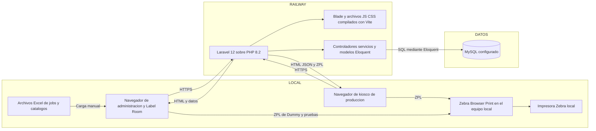
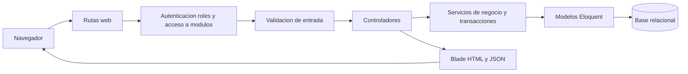
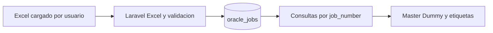
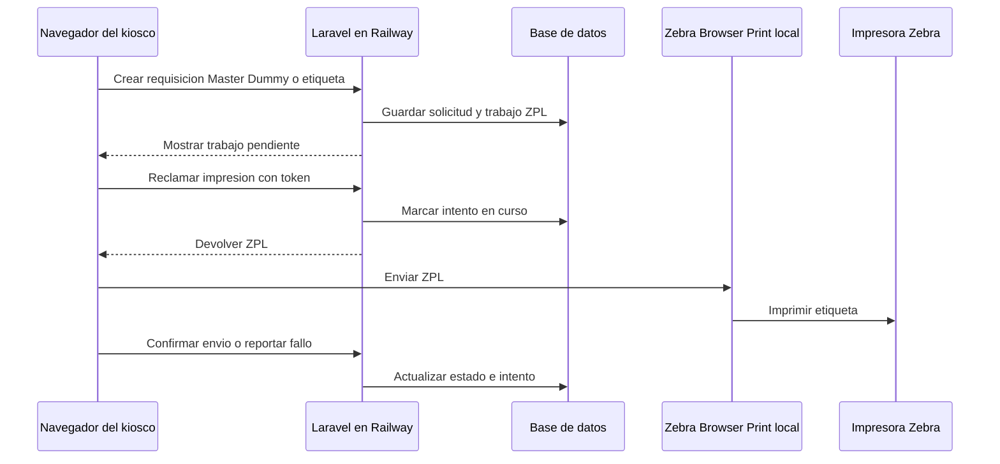

# Arquitectura de la aplicación y flujo de datos

**Sistema:** Label Control System.

**Referencia:** código del repositorio revisado el 17 de septiembre de 2026. El alojamiento en Railway fue indicado por el usuario; este repositorio no permite consultar el panel ni las variables del servicio desplegado.

**Alcance:** componentes de la aplicación, fronteras entre planta y nube, recorrido de los datos y persistencia. Para tablas, columnas y llaves foráneas, consultar el [modelo de base de datos](database-schema.md).

## Vista de despliegue y conexiones

**Lectura del diagrama:** Railway aloja la aplicación según la información proporcionada. El código configura MySQL como base de ejemplo, pero **no confirma dónde está alojada la base de producción**. La conexión física, el dominio y los secretos se definen fuera del código mediante variables de entorno. La aplicación no muestra una conexión directa a una base Oracle ni a MQTT: los jobs se importan desde archivos Excel.

## Componentes y responsabilidades

| Componente | Ubicación lógica | Responsabilidad y evidencia |
| --- | --- | --- |
| Navegadores de administración y Label Room | Estaciones del usuario | Formularios, revisión, importación y operaciones de producción. Las pantallas se sirven con Blade y JavaScript; ver [`routes/web.php`](../routes/web.php) y [`resources/views`](../resources/views). |
| Kiosco | Estación de producción | Registro de perfil, sesión propia, alta de requisiciones Master, Dummy y etiquetas estándar/LPK; ver rutas `/kiosk` en [`routes/web.php`](../routes/web.php). |
| Servicio web Laravel | Railway, según el usuario | Recibe peticiones, aplica middleware, valida formularios, ejecuta servicios de negocio y entrega HTML o JSON. El [`Dockerfile`](../Dockerfile) define PHP 8.2, `pdo_mysql` y un proceso `php artisan serve` en `${PORT:-8080}`. |
| Frontend | Compilado dentro de la imagen de la aplicación | Blade, JavaScript, Tailwind y Vite. La etapa de Node compila `public/build`; ver [`vite.config.js`](../vite.config.js). |
| Base relacional | Ubicación de producción por confirmar | Solicitudes, catálogos, seriales, lotes, usuarios y bitácoras. `.env.example` usa `DB_CONNECTION=mysql`; el código acepta parámetros `DB_*` o `DB_URL`; ver [`config/database.php`](../config/database.php). |
| Zebra Browser Print e impresora | Equipo local | El navegador descubre la impresora y le envía ZPL. El servidor guarda y entrega el ZPL de la etiqueta de requisición, pero el envío físico ocurre en el equipo local; ver [`kiosk-dashboard.js`](../resources/js/pages/kiosk-dashboard.js). |
| Archivo Excel de Oracle Jobs | Archivo cargado por un usuario | La importación actualiza `oracle_jobs` por `job_number`; ver [`OracleJobService.php`](../app/Services/Oracle/OracleJobService.php). El repositorio no contiene un conector Oracle en línea. |

## Organización interna de Laravel

Flujo habitual de una operación de negocio:

- **Entradas HTTP:** [`routes/web.php`](../routes/web.php) contiene las rutas de administración, Label Room y kiosco. [`bootstrap/app.php`](../bootstrap/app.php) registra `auth`, sesión de kiosco, rol, usuario activo y permiso de módulo; también define `/up` como ruta de salud.
- **Validación:** las clases de [`app/Http/Requests`](../app/Http/Requests) y la validación en los controladores comprueban las entradas de sus respectivas operaciones.
- **Lógica de negocio:** [`app/Services`](../app/Services) separa Oracle, Master, Dummies, etiquetas, kiosco, catálogos, acceso y dashboard. Las operaciones que crean o reservan varios registros usan transacciones en los servicios correspondientes.
- **Persistencia:** [`app/Models`](../app/Models) representa las entidades; [`database/migrations`](../database/migrations) define la estructura física.
- **Respuesta:** los controladores entregan vistas Blade, redirecciones o JSON para consultas e impresión. No se encontró un archivo de rutas `api.php` en este repositorio.

## Recorrido de los datos

### 1. Importación de Oracle y catálogos

Un usuario autorizado carga el Excel de jobs. `OracleJobService::importFromExcel` normaliza las filas y crea o actualiza registros de `oracle_jobs` dentro de una transacción. Master, Dummy y etiquetas consultan ese catálogo local al validar y llenar requisiciones. También hay importaciones Excel para `master_model_mappings` y `rating_assembly_mappings`. **La actualización de Oracle Jobs depende de una importación; el código revisado no programa una sincronización automática con Oracle.**

### 2. Requisiciones y trabajo de Label Room

| Flujo | Datos que recibe | Datos que guarda o consulta |
| --- | --- | --- |
| Master | Job, línea, turno, folios y contexto de producción | `oracle_jobs`, `master_requests`, `master_request_folios`; al imprimir, `master_print_batches` y `master_request_batch_items`. Un rework crea una nueva fila de `master_requests` relacionada con la solicitud raíz. |
| Dummy QR | Job, rango y tipo RMT/RW | `dummy_requests`, `dummy_request_items`, `dummy_print_batches` y `dummy_print_batch_items`. |
| Etiquetas estándar y LPK | Job, NP, cantidades, grupos y datos de envío | `label_requests` y sus renglones estándar o grupos/items LPK. Label Room libera la solicitud y registra `label_work_tasks`, `serial_ranges` y `label_administration_events`. |
| Catálogos e impresión de etiquetas | SKU, mercado, plantilla y perfil | `label_skus`, `sku_serial_formats` y variantes UL/EMEA/ANZ, `label_templates`, `label_print_profiles` y versiones. Las tablas de serialización e impresión conservan períodos, unidades, rangos, lotes y bloques; ver [modelo de base de datos](database-schema.md). |

Los números de job y códigos SKU se usan como referencias de negocio. Algunas de esas relaciones son coincidencias por texto y **no** llaves foráneas; están identificadas en el [modelo de base de datos](database-schema.md#enlaces-de-negocio-que-no-son-fk).

### 3. Impresión desde el kiosco

[`KioskRequisitionPrintService.php`](../app/Services/Kiosk/KioskRequisitionPrintService.php) prepara una fila de `kiosk_requisition_print_jobs` con token y ZPL para Master, Dummy o etiqueta. El navegador usa los endpoints `claim`, `confirm` y `fail`; tras enviar el ZPL a Browser Print, confirma el resultado en Laravel. El estado registrado significa que **el navegador reportó el envío**; el código no muestra una lectura de la impresora que verifique físicamente cada etiqueta. El navegador conserva datos de reintento en `localStorage`.

La impresión de Master en Label Room utiliza una vista HTML y `window.print()`; el centro de impresión Dummy utiliza Browser Print para enviar ZPL. Son caminos distintos de la etiqueta de requisición del kiosco.

## Almacenamiento y procesos de soporte

| Recurso | Configuración documentada en el repositorio | Estado que puede afirmarse |
| --- | --- | --- |
| Sesiones | `SESSION_DRIVER=database` en `.env.example` y valor predeterminado en [`config/session.php`](../config/session.php). | Existe la tabla `sessions`; el valor efectivo de Railway requiere revisar sus variables. |
| Caché | `CACHE_STORE=database` en `.env.example` y [`config/cache.php`](../config/cache.php). | Existen `cache` y `cache_locks`; no se puede confirmar el store efectivo del despliegue. |
| Cola | `QUEUE_CONNECTION=database` en `.env.example` y [`config/queue.php`](../config/queue.php). | Existen `jobs`, `job_batches` y `failed_jobs`. No se encontró despacho de trabajos de aplicación ni un worker en el comando de inicio del Dockerfile; no dibujar un proceso de cola activo sin verificarlo en Railway. |
| Archivos | `FILESYSTEM_DISK=local` en `.env.example`; [`config/filesystems.php`](../config/filesystems.php) también define un disco `s3` opcional. | Las importaciones Excel revisadas se procesan al subirlas. No se encontró uso de `Storage::` en `app`; no se puede afirmar que S3 o un volumen de Railway estén conectados. |
| Logs | `LOG_CHANNEL=stack` y `LOG_STACK=single` en `.env.example`; ver [`config/logging.php`](../config/logging.php). | El Dockerfile crea `storage/logs`; la retención real depende del despliegue. |
| Migraciones | [`database/migrations`](../database/migrations) define el esquema. | El comando de inicio del Dockerfile no ejecuta `php artisan migrate`; la forma de aplicarlas en Railway queda por confirmar. |

## Datos de Railway pendientes de confirmar

Para convertir este diagrama lógico en un plano exacto del ambiente productivo, faltan estos datos del panel de Railway: nombre y cantidad de servicios, origen de la imagen o Dockerfile, variables efectivas `DB_CONNECTION`, `DB_HOST` o `DB_URL` (sin publicar secretos), ubicación del servicio de base de datos, volúmenes, comando de despliegue/migraciones, workers y dominio público. Esta lista no implica que esos componentes existan; evita presentar como hechos configuraciones que el repositorio no muestra.
