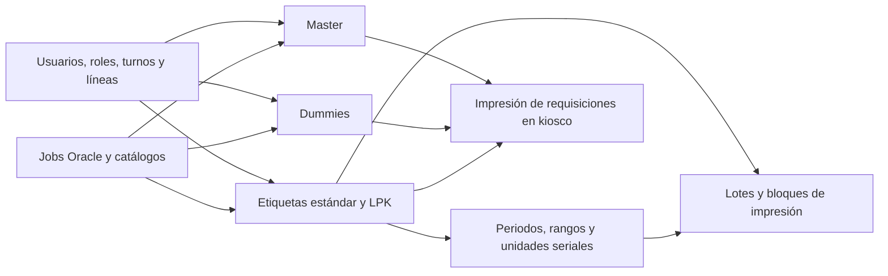
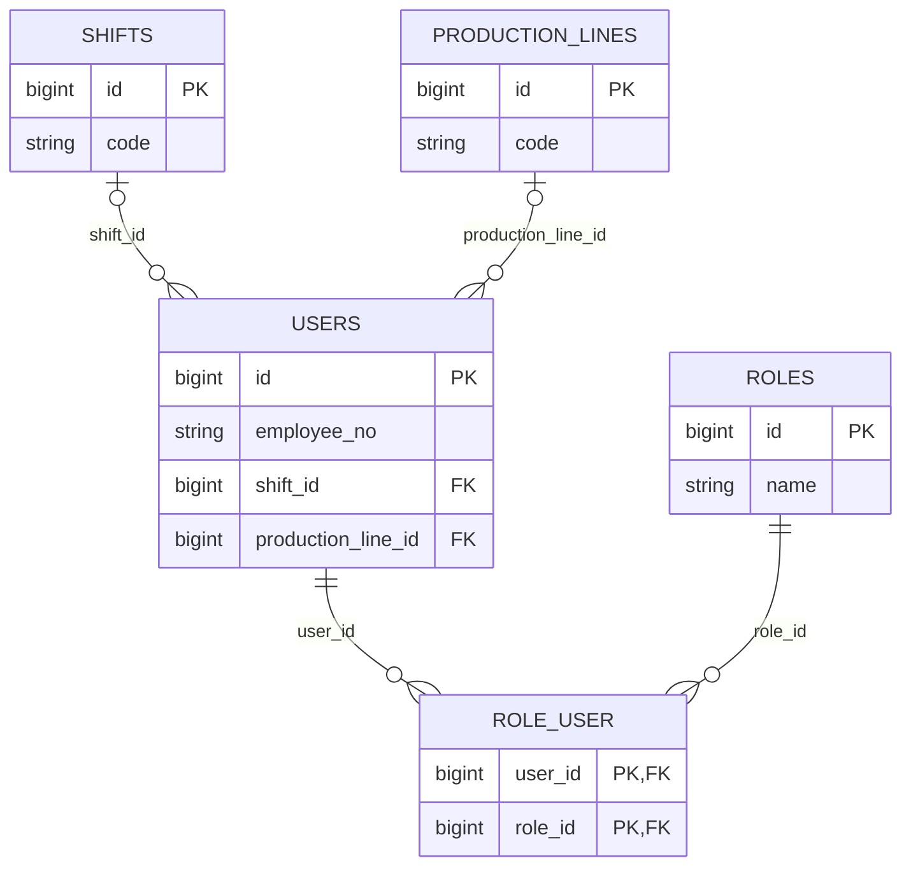
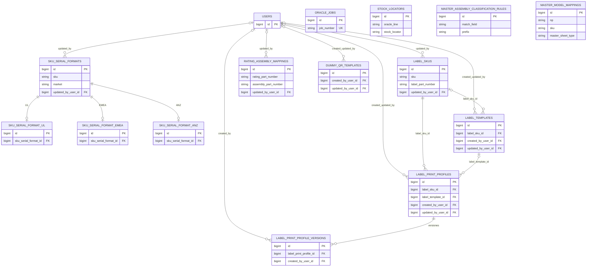
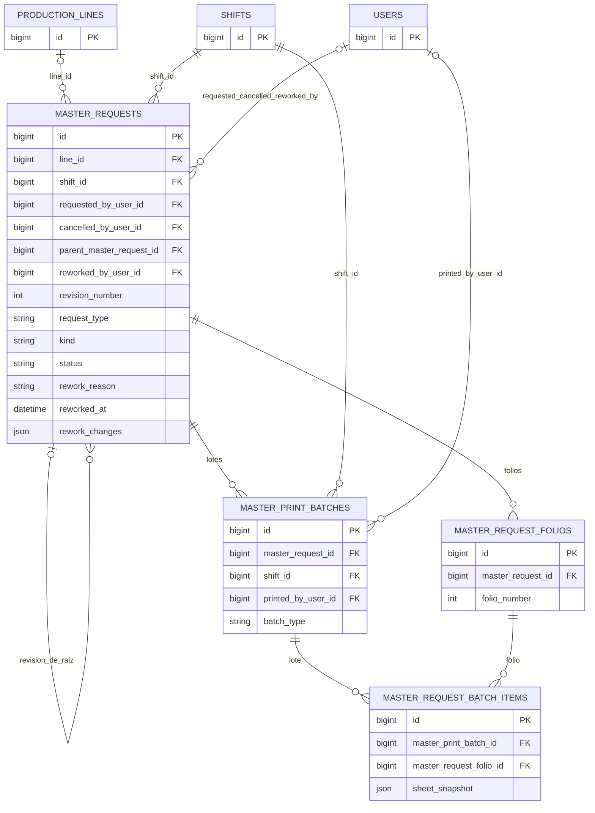
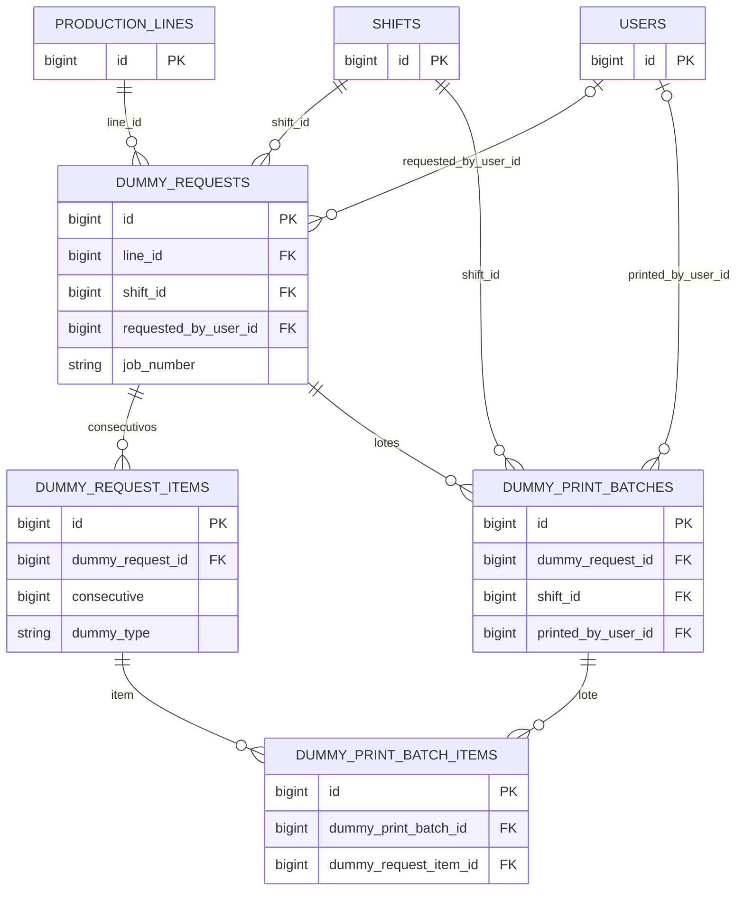
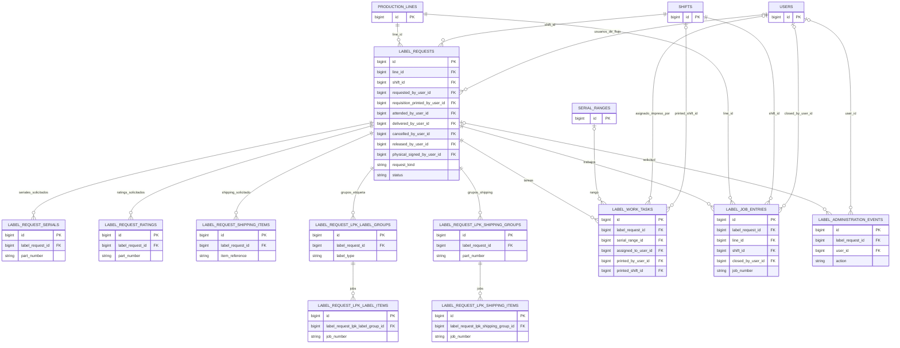
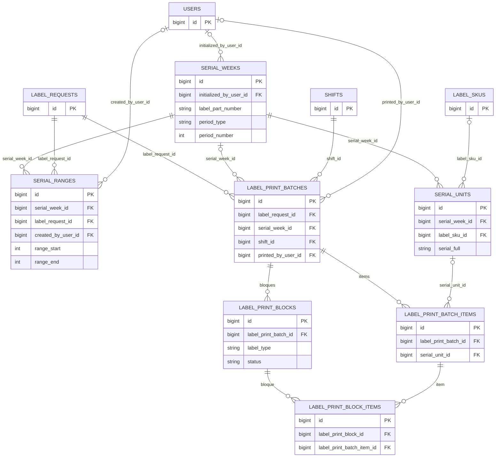
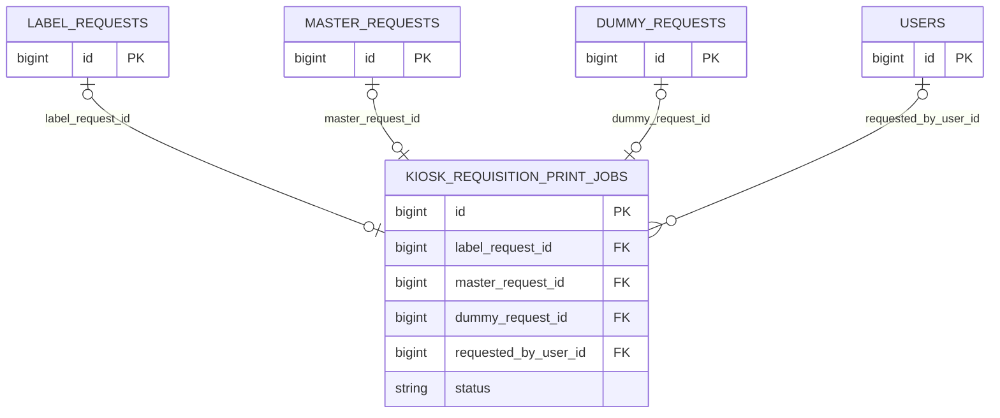

# Modelo de datos de Label Control System

**Base:** migraciones del repositorio hasta `2026_09_15_120000_preserve_kiosk_label_catalog_selections.php` (17 de septiembre de 2026). Son **52 tablas definidas por el proyecto**. Laravel crea además `migrations` para registrar qué migraciones se han ejecutado. Este documento describe el esquema esperado tras aplicar todas las migraciones; no se pudo consultar MySQL para comparar una base desplegada.

## Cómo leer los diagramas

- `PK` = llave primaria; `FK` = llave foránea **declarada en una migración**. El signo `?` tras el nombre de una columna en el inventario indica que acepta `NULL`.
- Los diagramas muestran las columnas que explican la relación y el flujo, no todas las columnas. El inventario de abajo enumera **todas las FK reales** de cada tabla.
- `||--o{` significa un padre obligatorio por registro hijo y cero o muchos hijos por padre. `o|--o{` indica que el hijo puede no apuntar a un padre. En `kiosk_requisition_print_jobs`, cada FK a una solicitud es además única.
- Números de job, SKU, NP, folios y nombres de operador pueden relacionar datos en la aplicación, pero **no se dibujan como FK** si la base no los restringe.

## Vista general



### 1. Acceso y contexto de producción



`sessions.user_id` está indexado, pero **no tiene constraint FK**. Las tablas técnicas de Laravel tampoco se enlazan por FK con las tablas del negocio.

### 2. Catálogos y configuración



`oracle_jobs`, `stock_locators`, `master_model_mappings` y `master_assembly_classification_rules` son catálogos sin FK; por eso aparecen aislados. `sku_serial_formats.sku` y `label_skus.sku` se comparan por valor, sin FK entre ambas tablas.

### 3. Solicitudes Master



`master_requests.line_id` se volvió opcional para solicitudes manuales.

**Rework Master:** cada rework crea **otra fila en `master_requests`** con `kind = rework` y `revision_number` incremental. `parent_master_request_id` apunta a la **solicitud raíz original**, incluso si el rework se hizo a partir de otra revisión; el ID de esa revisión base queda en `rework_changes.base_request_id` (JSON, no FK). La combinación `(parent_master_request_id, revision_number)` es única. `rework_reason`, `reworked_by_user_id`, `reworked_by_name`, `reworked_at` y `rework_changes` guardan el motivo, autor y cambios.

La nueva revisión recibe **sus propios** `master_request_folios` (seleccionados y adicionales). Su impresión inicial crea un `master_print_batches` con `batch_type = rework`; `master_request_batch_items` relaciona ese lote con los folios de la revisión y conserva `sheet_snapshot`. Los lotes y folios anteriores permanecen asociados a sus respectivas solicitudes.

### 4. Dummies



### 5. Solicitudes de etiquetas y administración de Label Room

`label_requests.request_kind` distingue `standard` de `lpk`; **LPK no tiene una tabla de solicitudes independiente**.



### 6. Serialización e impresión de etiquetas

La tabla física `serial_weeks` ahora controla periodos semanales **o mensuales** mediante `period_type` y `period_number`. Su nombre histórico se conserva por las FK existentes.



### 7. Impresión de requisiciones en kiosco



Cada una de las tres FK de solicitud acepta `NULL` y tiene `UNIQUE`: como máximo hay un trabajo de requisición por solicitud de cada tipo. La aplicación usa una de ellas según el tipo de requisición.

## Inventario de tablas y FK reales

Las columnas de FK se muestran como `columna → tabla.id`. `—` significa que la tabla no tiene FK. Todas las tablas con nombre del inventario son las **vigentes** después de la última migración.

### Acceso y plataforma

| Tabla | Módulo / función | FK reales |
| --- | --- | --- |
| `shifts` | Turnos: catálogo compartido por usuarios, solicitudes e impresiones. | — |
| `production_lines` | Producción: líneas usadas por usuarios y requisiciones. | — |
| `users` | Acceso, permisos por módulo y perfil de producción. | `shift_id? → shifts.id`; `production_line_id? → production_lines.id` |
| `roles` | Acceso: roles del sistema. | — |
| `role_user` | Acceso: asignación N:M de roles a usuarios; PK compuesta `(user_id, role_id)`. | `user_id → users.id`; `role_id → roles.id` |
| `sessions` | Laravel: sesiones web. | — (`user_id` tiene índice, sin FK) |
| `cache` | Laravel: valores de caché. | — |
| `cache_locks` | Laravel: bloqueos de caché. | — |
| `jobs` | Laravel: cola de trabajos. | — |
| `job_batches` | Laravel: agrupación de trabajos de cola. | — |
| `failed_jobs` | Laravel: errores de trabajos de cola. | — |
| `migrations` | Laravel: historial de migraciones; creada por el framework. | — |

### Importación Oracle y catálogos de negocio

| Tabla | Módulo / función | FK reales |
| --- | --- | --- |
| `oracle_jobs` | Importación Oracle: jobs y datos de producción/envío; `job_number` es único. | — |
| `stock_locators` | Catálogo Oracle: mapea `oracle_line` a subinventario y localizador. | — |
| `master_assembly_classification_rules` | Catálogo Master: reglas de clasificación de ensamble/empaque por prefijo. | — |
| `master_model_mappings` | Catálogo Master: NP ↔ SKU y tipo de hoja Master. | — |
| `rating_assembly_mappings` | Catálogo de etiquetas: Rating NP ↔ Assembly NP/mercado y NP de serial, shipping e inner. | `updated_by_user_id? → users.id` |
| `label_skus` | Catálogo de etiquetas: SKU, mercado, NP de etiqueta y piezas relacionadas. | `updated_by_user_id? → users.id` |
| `sku_serial_formats` | Configuración serial: formato base por SKU/mercado. | `updated_by_user_id? → users.id` |
| `sku_serial_format_ul` | Configuración serial: parámetros UL, un registro por formato base. | `sku_serial_format_id → sku_serial_formats.id` |
| `sku_serial_format_emea` | Configuración serial: parámetros EMEA, un registro por formato base. | `sku_serial_format_id → sku_serial_formats.id` |
| `sku_serial_format_anz` | Configuración serial: parámetros ANZ, un registro por formato base. | `sku_serial_format_id → sku_serial_formats.id` |
| `label_templates` | Impresión de etiquetas: ZPL y layout serial, global o por SKU. | `label_sku_id? → label_skus.id`; `created_by_user_id? → users.id`; `updated_by_user_id? → users.id` |
| `label_print_profiles` | Impresión de etiquetas: ajustes de impresora, medio y plantilla por SKU. | `label_sku_id → label_skus.id`; `label_template_id? → label_templates.id`; `created_by_user_id? → users.id`; `updated_by_user_id? → users.id` |
| `label_print_profile_versions` | Impresión de etiquetas: snapshots/versiones de un perfil. | `label_print_profile_id → label_print_profiles.id`; `created_by_user_id? → users.id` |
| `dummy_qr_templates` | Dummies: plantillas ZPL/QR por tipo RMT o RW. | `created_by_user_id? → users.id`; `updated_by_user_id? → users.id` |

### Master

| Tabla | Módulo / función | FK reales |
| --- | --- | --- |
| `master_requests` | Requisiciones Master; cada rework es otra fila con `kind = rework`, `revision_number`, motivo y cambios JSON. | `line_id? → production_lines.id`; `shift_id → shifts.id`; `requested_by_user_id? → users.id`; `cancelled_by_user_id? → users.id`; `parent_master_request_id? → master_requests.id` (raíz); `reworked_by_user_id? → users.id` |
| `master_request_folios` | Folios individuales y estado dentro de una requisición Master. | `master_request_id → master_requests.id` |
| `master_print_batches` | Lotes de impresión, reimpresión y rework Master. | `master_request_id → master_requests.id`; `shift_id → shifts.id`; `printed_by_user_id? → users.id` |
| `master_request_batch_items` | Cruce lote ↔ folio impreso, copias y snapshot de hoja. | `master_print_batch_id → master_print_batches.id`; `master_request_folio_id → master_request_folios.id` |

### Dummies

| Tabla | Módulo / función | FK reales |
| --- | --- | --- |
| `dummy_requests` | Requisiciones de dummy por job, rango y tipo de solicitud. | `line_id → production_lines.id`; `shift_id → shifts.id`; `requested_by_user_id? → users.id` |
| `dummy_request_items` | Consecutivos RMT/RW y payload QR de cada requisición. | `dummy_request_id → dummy_requests.id` |
| `dummy_print_batches` | Lotes de impresión y reimpresión de dummies. | `dummy_request_id → dummy_requests.id`; `shift_id → shifts.id`; `printed_by_user_id? → users.id` |
| `dummy_print_batch_items` | Cruce lote ↔ consecutivo impreso. | `dummy_print_batch_id → dummy_print_batches.id`; `dummy_request_item_id → dummy_request_items.id` |

### Etiquetas estándar, LPK y administración

| Tabla | Módulo / función | FK reales |
| --- | --- | --- |
| `label_requests` | Requisición estándar o LPK; estado de preparación, entrega, cancelación y liberación. | `line_id → production_lines.id`; `shift_id → shifts.id`; `requested_by_user_id? → users.id`; `requisition_printed_by_user_id? → users.id`; `attended_by_user_id? → users.id`; `delivered_by_user_id? → users.id`; `cancelled_by_user_id? → users.id`; `released_by_user_id? → users.id`; `physical_signed_by_user_id? → users.id` |
| `label_request_serials` | Renglones de NP serial/modelo solicitados. | `label_request_id → label_requests.id` |
| `label_request_ratings` | Renglones de NP Rating/modelo solicitados. | `label_request_id → label_requests.id` |
| `label_request_shipping_items` | Referencias de shipping/modelo solicitadas. | `label_request_id → label_requests.id` |
| `label_request_lpk_label_groups` | LPK: grupo por tipo de etiqueta y NP. | `label_request_id → label_requests.id` |
| `label_request_lpk_label_items` | LPK: jobs, modelos y cantidades dentro de un grupo de etiqueta. | `label_request_lpk_label_group_id → label_request_lpk_label_groups.id` |
| `label_request_lpk_shipping_groups` | LPK: grupo de shipping, cantidad, PO y destino. | `label_request_id → label_requests.id` |
| `label_request_lpk_shipping_items` | LPK: jobs/modelos dentro de un grupo de shipping. | `label_request_lpk_shipping_group_id → label_request_lpk_shipping_groups.id` |
| `label_work_tasks` | Label Room: tareas de preparación/impresión, asignación y rango serial. | `label_request_id → label_requests.id`; `serial_range_id? → serial_ranges.id`; `assigned_to_user_id? → users.id`; `printed_by_user_id? → users.id`; `printed_shift_id? → shifts.id` |
| `label_job_entries` | Label Room: cierre de jobs por fecha, línea y turno. | `label_request_id → label_requests.id`; `line_id → production_lines.id`; `shift_id → shifts.id`; `closed_by_user_id? → users.id` |
| `label_administration_events` | Label Room: bitácora de acciones administrativas. | `label_request_id? → label_requests.id`; `user_id? → users.id` |

### Serialización e impresión de etiquetas

| Tabla | Módulo / función | FK reales |
| --- | --- | --- |
| `serial_weeks` | Control de periodo serial semanal/mensual, prefijo y último consecutivo. | `initialized_by_user_id? → users.id` |
| `serial_ranges` | Rangos reservados para una requisición y su evidencia de producción. | `serial_week_id → serial_weeks.id`; `label_request_id → label_requests.id`; `created_by_user_id? → users.id` |
| `serial_units` | Seriales individuales asignados e historial de impresión de serial/Rating. | `serial_week_id → serial_weeks.id`; `label_sku_id? → label_skus.id` |
| `label_print_batches` | Lotes de impresión/reimpresión de una requisición. | `label_request_id → label_requests.id`; `serial_week_id? → serial_weeks.id`; `shift_id → shifts.id`; `printed_by_user_id? → users.id` |
| `label_print_batch_items` | Items impresos de un lote; unidad serial opcional. | `label_print_batch_id → label_print_batches.id`; `serial_unit_id? → serial_units.id` |
| `label_print_blocks` | Bloques de envío/confirmación/fallo por tipo de etiqueta en un lote. | `label_print_batch_id → label_print_batches.id` |
| `label_print_block_items` | Cruce bloque ↔ item de lote. | `label_print_block_id → label_print_blocks.id`; `label_print_batch_item_id → label_print_batch_items.id` |

### Kiosco

| Tabla | Módulo / función | FK reales |
| --- | --- | --- |
| `kiosk_requisition_print_jobs` | Trabajo ZPL para imprimir la requisición de etiquetas, Master o Dummy. | `label_request_id? → label_requests.id` (única); `master_request_id? → master_requests.id` (única); `dummy_request_id? → dummy_requests.id` (única); `requested_by_user_id? → users.id` |

## Enlaces de negocio que no son FK

| Campos | Relación usada por la aplicación |
| --- | --- |
| `label_requests.job_number` ↔ `oracle_jobs.job_number` | Eloquent declara esta relación por número de job; la migración no crea una FK. Master y Dummy también guardan números de job sin FK. |
| `label_skus.sku` ↔ `sku_serial_formats.sku` | Coincidencia de SKU/mercado para configuración serial; no hay FK. |
| `label_requests.label_part_number`, `serial_weeks.label_part_number`, NP en catálogos | Referencias por texto al producto/etiqueta; no hay FK entre estas tablas. |
| `stock_locators.oracle_line` ↔ línea Oracle | Mapeo textual de línea a localizador, sin FK hacia `oracle_jobs` ni `production_lines`. |
| `sessions.user_id` ↔ `users.id` | Columna con índice para sesiones, sin FK declarada. |

**Mantenimiento:** cuando una migración agregue, quite o renombre una tabla/FK, actualizar el diagrama del módulo y la fila correspondiente del inventario.

## Diagrama completo: tablas y columnas

Vista física de todas las tablas tras las migraciones de este repositorio, incluida `migrations` de Laravel. Muestra **todas las columnas** y marca `PK`, `FK` y `UK` (índice único de una sola columna). Los índices únicos compuestos y la nulabilidad detallada se consultan en las migraciones y en el inventario anterior. Por su tamaño, conviene abrir la vista previa con zoom.

```mermaid
erDiagram
    direction LR
    SHIFTS {
        bigint id PK
        string code UK
        string name
        boolean active
        timestamp created_at
        timestamp updated_at
    }
    PRODUCTION_LINES {
        bigint id PK
        string code UK
        string name
        string line_type
        boolean active
        timestamp created_at
        timestamp updated_at
    }
    USERS {
        bigint id PK
        string employee_no UK
        string name
        string password
        string remember_token
        bigint shift_id FK
        boolean is_active
        timestamp last_login_at
        timestamp created_at
        timestamp updated_at
        json module_permissions
        bigint production_line_id FK
        string position
    }
    ROLES {
        bigint id PK
        string name UK
        string description
        timestamp created_at
        timestamp updated_at
    }
    ROLE_USER {
        bigint user_id PK, FK
        bigint role_id PK, FK
    }
    SESSIONS {
        string id PK
        bigint user_id
        string ip_address
        text user_agent
        longtext payload
        int last_activity
    }
    CACHE {
        string key PK
        mediumtext value
        int expiration
    }
    CACHE_LOCKS {
        string key PK
        string owner
        int expiration
    }
    JOBS {
        bigint id PK
        string queue
        longtext payload
        tinyint attempts
        int reserved_at
        int available_at
        int created_at
    }
    JOB_BATCHES {
        string id PK
        string name
        int total_jobs
        int pending_jobs
        int failed_jobs
        longtext failed_job_ids
        mediumtext options
        int cancelled_at
        int created_at
        int finished_at
    }
    FAILED_JOBS {
        bigint id PK
        string uuid UK
        text connection
        text queue
        longtext payload
        longtext exception
        timestamp failed_at
    }
    MIGRATIONS {
        int id PK
        string migration
        int batch
    }
    ORACLE_JOBS {
        bigint id PK
        string job_number UK
        string line
        string job_status
        string assembly
        string bom_revision
        text part_description
        int job_qty
        int qty_completed
        int quantity_remainder
        datetime scheduled_start_date
        datetime last_update_date
        text job_description
        string ttl_cust_po
        string ship_to
        string ship_code
        text ship_address
        string source_file_name
        datetime imported_at
        timestamp created_at
        timestamp updated_at
    }
    STOCK_LOCATORS {
        bigint id PK
        string subinventory
        boolean active
        timestamp created_at
        timestamp updated_at
        string oracle_line UK
        string stock_locator
    }
    MASTER_ASSEMBLY_CLASSIFICATION_RULES {
        bigint id PK
        string match_field
        string prefix
        string description
        boolean allows_assembly
        boolean allows_packaging
        boolean active
        timestamp created_at
        timestamp updated_at
    }
    MASTER_MODEL_MAPPINGS {
        bigint id PK
        string np
        string sku
        string master_sheet_type
        boolean active
        timestamp created_at
        timestamp updated_at
    }
    RATING_ASSEMBLY_MAPPINGS {
        bigint id PK
        string rating_part_number
        string assembly_part_number
        string market
        boolean active
        bigint updated_by_user_id FK
        timestamp created_at
        timestamp updated_at
        string serial_part_number
        string shipping_part_number
        string inner_part_number
    }
    LABEL_SKUS {
        bigint id PK
        string sku
        string serial_standard
        string label_part_number
        string description
        string console_sku
        string assembly_part_number
        string packaging_part_number
        string emea_sku
        string anz_sku
        boolean is_active
        bigint updated_by_user_id FK
        timestamp created_at
        timestamp updated_at
    }
    SKU_SERIAL_FORMATS {
        bigint id PK
        string sku
        string serial_standard
        string serial_scheme
        string separator
        tinyint year_digits
        tinyint week_digits
        boolean include_year
        boolean include_week
        string pattern
        tinyint unit_length
        int next_unit
        boolean is_active
        bigint updated_by_user_id FK
        timestamp created_at
        timestamp updated_at
        string description
        smallint serial_length
        string qr_payload_format
        string date_mode
        boolean month_letter_enabled
        string month_letter_map
        tinyint unit_digits
        string market
    }
    SKU_SERIAL_FORMAT_UL {
        bigint id PK
        bigint sku_serial_format_id FK, UK
        string prefix
        tinyint prefix_length
        string serial_break
        string plant_code
        boolean use_plant_code
        string reset_scope
        string pattern
        timestamp created_at
        timestamp updated_at
    }
    SKU_SERIAL_FORMAT_EMEA {
        bigint id PK
        bigint sku_serial_format_id FK, UK
        string prefix_value
        string conformity_code
        tinyint unit_digits
        string pattern
        timestamp created_at
        timestamp updated_at
    }
    SKU_SERIAL_FORMAT_ANZ {
        bigint id PK
        bigint sku_serial_format_id FK, UK
        string product_prefix
        tinyint product_prefix_length
        string tool_version_letter
        boolean tool_version_required
        string customer_tool_code
        boolean customer_tool_code_required
        tinyint unit_digits
        string qr_separator
        boolean include_customer_tool_code_in_qr
        string print_format
        string reset_scope
        string pattern
        string qr_pattern
        timestamp created_at
        timestamp updated_at
    }
    LABEL_TEMPLATES {
        bigint id PK
        string name
        string label_type
        string serial_standard
        bigint label_sku_id FK
        smallint dpi
        decimal width_mm
        decimal height_mm
        longtext zpl
        json serial_layout
        json meta
        int version
        boolean is_active
        bigint created_by_user_id FK
        bigint updated_by_user_id FK
        timestamp created_at
        timestamp updated_at
    }
    LABEL_PRINT_PROFILES {
        bigint id PK
        bigint label_sku_id FK
        string label_type
        string serial_standard
        string name
        string default_printer_name
        string default_printer_ip
        smallint dpi
        tinyint darkness
        tinyint speed
        string media_type
        string print_mode
        int offset_x
        int offset_y
        json settings
        boolean is_active
        bigint created_by_user_id FK
        bigint updated_by_user_id FK
        timestamp created_at
        timestamp updated_at
        bigint label_template_id FK
        string media_tracking
    }
    LABEL_PRINT_PROFILE_VERSIONS {
        bigint id PK
        bigint label_print_profile_id FK
        int version
        json snapshot
        bigint created_by_user_id FK
        timestamp created_at
        timestamp updated_at
    }
    DUMMY_QR_TEMPLATES {
        bigint id PK
        string name
        enum dummy_type
        smallint dpi
        decimal width_mm
        decimal height_mm
        smallint qr_x
        smallint qr_y
        tinyint qr_magnification
        char qr_orientation
        smallint fg_x
        smallint fg_y
        tinyint fg_font_size
        smallint job_x
        smallint job_y
        tinyint job_font_size
        smallint consecutive_x
        smallint consecutive_y
        tinyint consecutive_font_size
        smallint title_x
        smallint title_y
        tinyint title_font_size
        enum connection_type
        string default_printer_name
        string default_printer_ip
        longtext zpl
        boolean is_active
        bigint created_by_user_id FK
        bigint updated_by_user_id FK
        timestamp created_at
        timestamp updated_at
    }
    MASTER_REQUESTS {
        bigint id PK
        date request_date
        tinyint week
        bigint line_id FK
        bigint shift_id FK
        string leader_name
        string requested_by_name
        bigint requested_by_user_id FK
        string po_number
        string job_assembly
        string job_packaging
        string destination
        int folios_from
        int folios_to
        int std_pack_qty
        int partial_folio
        int partial_qty
        string request_type
        string kind
        string status
        text notes
        timestamp created_at
        timestamp updated_at
        string local
        string oracle_line
        string subinventory
        string request_source
        text cancellation_reason
        datetime cancelled_at
        bigint cancelled_by_user_id FK
        string cancelled_by_name
        bigint parent_master_request_id FK
        smallint revision_number
        string model
        text rework_reason
        bigint reworked_by_user_id FK
        string reworked_by_name
        datetime reworked_at
        json rework_changes
        boolean is_manual
        text manual_reason
    }
    MASTER_REQUEST_FOLIOS {
        bigint id PK
        bigint master_request_id FK
        int folio_number
        boolean is_partial
        int qty_for_folio
        string status
        timestamp created_at
        timestamp updated_at
    }
    MASTER_PRINT_BATCHES {
        bigint id PK
        bigint master_request_id FK
        bigint shift_id FK
        string batch_type
        text reason
        bigint printed_by_user_id FK
        string printed_by_name
        datetime printed_at
        timestamp created_at
        timestamp updated_at
    }
    MASTER_REQUEST_BATCH_ITEMS {
        bigint id PK
        bigint master_print_batch_id FK
        bigint master_request_folio_id FK
        int copies
        timestamp created_at
        timestamp updated_at
        json sheet_snapshot
    }
    DUMMY_REQUESTS {
        bigint id PK
        date request_date
        tinyint week
        bigint line_id FK
        bigint shift_id FK
        string leader_name
        string requested_by_name
        bigint requested_by_user_id FK
        string job_number
        string fg_code
        int quantity_requested
        bigint range_from
        bigint range_to
        enum request_type
        enum status
        text notes
        timestamp created_at
        timestamp updated_at
    }
    DUMMY_REQUEST_ITEMS {
        bigint id PK
        bigint dummy_request_id FK
        string job_number
        string fg_code
        bigint consecutive
        string consecutive_10d
        enum dummy_type
        string qr_payload
        int print_count
        timestamp last_printed_at
        timestamp created_at
        timestamp updated_at
    }
    DUMMY_PRINT_BATCHES {
        bigint id PK
        bigint dummy_request_id FK
        bigint shift_id FK
        enum batch_type
        string reason
        bigint printed_by_user_id FK
        string printed_by_name
        int quantity
        timestamp printed_at
        timestamp created_at
        timestamp updated_at
    }
    DUMMY_PRINT_BATCH_ITEMS {
        bigint id PK
        bigint dummy_print_batch_id FK
        bigint dummy_request_item_id FK
        smallint copies
        timestamp created_at
        timestamp updated_at
    }
    LABEL_REQUESTS {
        bigint id PK
        date request_date
        tinyint week
        bigint line_id FK
        bigint shift_id FK
        string leader_name
        string requested_by_name
        bigint requested_by_user_id FK
        string label_part_number
        string serial_standard
        string po_number
        string destination
        string model
        string job_number
        int quantity_requested
        boolean include_serial
        boolean include_rating
        enum status
        text notes
        timestamp created_at
        timestamp updated_at
        bigint folio_start
        bigint folio_end
        boolean include_shipping
        timestamp requisition_printed_at
        bigint requisition_printed_by_user_id FK
        timestamp attended_at
        bigint attended_by_user_id FK
        timestamp delivered_at
        bigint delivered_by_user_id FK
        timestamp cancelled_at
        bigint cancelled_by_user_id FK
        string serial_part_number
        int shipping_quantity
        boolean include_inner
        string request_kind
        string inner_part_number
        string inner_model
        string shipping_part_number
        string shipping_model
        string folio_mode
        string job_status
        smallint control_year
        tinyint control_week
        text review_notes
        timestamp released_at
        bigint released_by_user_id FK
        timestamp originals_received_at
        timestamp physical_signed_at
        bigint physical_signed_by_user_id FK
        string serial_period_type
        smallint serial_period_year
        tinyint serial_period_number
        json catalog_context
    }
    LABEL_REQUEST_SERIALS {
        bigint id PK
        bigint label_request_id FK
        string part_number
        smallint position
        timestamp created_at
        timestamp updated_at
        string model
    }
    LABEL_REQUEST_RATINGS {
        bigint id PK
        bigint label_request_id FK
        string part_number
        smallint position
        timestamp created_at
        timestamp updated_at
        string model
    }
    LABEL_REQUEST_SHIPPING_ITEMS {
        bigint id PK
        bigint label_request_id FK
        string item_reference
        smallint position
        timestamp created_at
        timestamp updated_at
        string model
    }
    LABEL_REQUEST_LPK_LABEL_GROUPS {
        bigint id PK
        bigint label_request_id FK
        string label_type
        string part_number
        smallint position
        timestamp created_at
        timestamp updated_at
    }
    LABEL_REQUEST_LPK_LABEL_ITEMS {
        bigint id PK
        bigint label_request_lpk_label_group_id FK
        string job_number
        string model
        int quantity
        smallint position
        timestamp created_at
        timestamp updated_at
    }
    LABEL_REQUEST_LPK_SHIPPING_GROUPS {
        bigint id PK
        bigint label_request_id FK
        string part_number
        int quantity
        string po_number
        string destination
        smallint position
        timestamp created_at
        timestamp updated_at
    }
    LABEL_REQUEST_LPK_SHIPPING_ITEMS {
        bigint id PK
        bigint label_request_lpk_shipping_group_id FK
        string job_number
        string model
        smallint position
        timestamp created_at
        timestamp updated_at
    }
    LABEL_WORK_TASKS {
        bigint id PK
        bigint label_request_id FK
        string source_key
        string rating_part_number
        string folio_family
        smallint control_year
        tinyint control_week
        string original_reference
        string label_type
        string part_number
        string model
        string job_number
        json jobs
        string po_number
        string destination
        int quantity
        smallint evidence_quantity
        bigint serial_range_id FK
        int folio_start
        int folio_end
        int evidence_folio
        string status
        bigint assigned_to_user_id FK
        bigint printed_by_user_id FK
        string printed_by_name
        bigint printed_shift_id FK
        date work_date
        timestamp completed_at
        timestamp created_at
        timestamp updated_at
        string serial_period_type
        smallint serial_period_year
        tinyint serial_period_number
    }
    LABEL_JOB_ENTRIES {
        bigint id PK
        bigint label_request_id FK
        string job_number
        string model
        string po_number
        int quantity
        int shipping_quantity
        json shared_shipping
        date work_date
        bigint line_id FK
        bigint shift_id FK
        bigint closed_by_user_id FK
        timestamp created_at
        timestamp updated_at
    }
    LABEL_ADMINISTRATION_EVENTS {
        bigint id PK
        bigint label_request_id FK
        bigint user_id FK
        string action
        json details
        timestamp created_at
    }
    SERIAL_WEEKS {
        bigint id PK
        string label_part_number
        string serial_standard
        tinyint week
        smallint year
        string prefix
        int last_serial_number
        timestamp created_at
        timestamp updated_at
        string folio_family
        int opening_serial_number
        text opening_notes
        bigint initialized_by_user_id FK
        string period_type
        tinyint period_number
    }
    SERIAL_RANGES {
        bigint id PK
        bigint serial_week_id FK
        int range_start
        int range_end
        int quantity
        bigint label_request_id FK
        bigint created_by_user_id FK
        timestamp created_at
        timestamp updated_at
        int production_quantity
        smallint evidence_quantity
        int evidence_folio
        string job_number
        string model
        string status
    }
    SERIAL_UNITS {
        bigint id PK
        bigint serial_week_id FK
        bigint label_sku_id FK
        string label_part_number
        string serial_standard
        int serial_number
        string serial_full UK
        string rating_qr_code
        enum status
        timestamp printed_at
        timestamp created_at
        timestamp updated_at
        timestamp serial_printed_at
        timestamp rating_printed_at
    }
    LABEL_PRINT_BATCHES {
        bigint id PK
        bigint label_request_id FK
        bigint serial_week_id FK
        bigint shift_id FK
        enum batch_type
        string reason
        bigint printed_by_user_id FK
        string printed_by_name
        timestamp printed_at
        timestamp created_at
        timestamp updated_at
    }
    LABEL_PRINT_BATCH_ITEMS {
        bigint id PK
        bigint label_print_batch_id FK
        bigint serial_unit_id FK
        boolean print_serial
        boolean print_rating
        smallint copies
        timestamp created_at
        timestamp updated_at
    }
    LABEL_PRINT_BLOCKS {
        bigint id PK
        bigint label_print_batch_id FK
        enum label_type
        int sequence
        int unit_count
        int label_count
        enum status
        int attempts
        timestamp sent_at
        timestamp confirmed_at
        timestamp failed_at
        string last_error
        timestamp created_at
        timestamp updated_at
    }
    LABEL_PRINT_BLOCK_ITEMS {
        bigint id PK
        bigint label_print_block_id FK
        bigint label_print_batch_item_id FK
        timestamp created_at
        timestamp updated_at
    }
    KIOSK_REQUISITION_PRINT_JOBS {
        bigint id PK
        uuid token UK
        bigint label_request_id FK, UK
        bigint requested_by_user_id FK
        string status
        smallint attempts
        string printer_name
        longtext zpl
        text last_error
        timestamp dispatched_at
        timestamp printed_at
        timestamp created_at
        timestamp updated_at
        bigint master_request_id FK, UK
        bigint dummy_request_id FK, UK
    }
    SHIFTS o|--o{ USERS : shift_id
    PRODUCTION_LINES o|--o{ USERS : production_line_id
    USERS ||--o{ ROLE_USER : user_id
    ROLES ||--o{ ROLE_USER : role_id
    PRODUCTION_LINES o|--o{ MASTER_REQUESTS : line_id
    SHIFTS o|--o{ MASTER_REQUESTS : shift_id
    USERS o|--o{ MASTER_REQUESTS : "3 FK"
    MASTER_REQUESTS o|--o{ MASTER_REQUESTS : parent_master_request_id
    MASTER_REQUESTS ||--o{ MASTER_REQUEST_FOLIOS : master_request_id
    MASTER_REQUESTS ||--o{ MASTER_PRINT_BATCHES : master_request_id
    SHIFTS o|--o{ MASTER_PRINT_BATCHES : shift_id
    USERS o|--o{ MASTER_PRINT_BATCHES : printed_by_user_id
    MASTER_PRINT_BATCHES ||--o{ MASTER_REQUEST_BATCH_ITEMS : master_print_batch_id
    MASTER_REQUEST_FOLIOS ||--o{ MASTER_REQUEST_BATCH_ITEMS : master_request_folio_id
    PRODUCTION_LINES ||--o{ LABEL_REQUESTS : line_id
    SHIFTS ||--o{ LABEL_REQUESTS : shift_id
    USERS o|--o{ LABEL_REQUESTS : "7 FK"
    LABEL_REQUESTS ||--o{ LABEL_PRINT_BATCHES : label_request_id
    SERIAL_WEEKS o|--o{ LABEL_PRINT_BATCHES : serial_week_id
    SHIFTS ||--o{ LABEL_PRINT_BATCHES : shift_id
    USERS o|--o{ LABEL_PRINT_BATCHES : printed_by_user_id
    LABEL_PRINT_BATCHES ||--o{ LABEL_PRINT_BATCH_ITEMS : label_print_batch_id
    SERIAL_UNITS o|--o{ LABEL_PRINT_BATCH_ITEMS : serial_unit_id
    USERS o|--o{ LABEL_SKUS : updated_by_user_id
    USERS o|--o{ SKU_SERIAL_FORMATS : updated_by_user_id
    USERS o|--o{ SERIAL_WEEKS : initialized_by_user_id
    SERIAL_WEEKS ||--o{ SERIAL_RANGES : serial_week_id
    LABEL_REQUESTS ||--o{ SERIAL_RANGES : label_request_id
    USERS o|--o{ SERIAL_RANGES : created_by_user_id
    SERIAL_WEEKS ||--o{ SERIAL_UNITS : serial_week_id
    LABEL_SKUS o|--o{ SERIAL_UNITS : label_sku_id
    LABEL_SKUS o|--o{ LABEL_TEMPLATES : label_sku_id
    USERS o|--o{ LABEL_TEMPLATES : "2 FK"
    LABEL_SKUS ||--o{ LABEL_PRINT_PROFILES : label_sku_id
    USERS o|--o{ LABEL_PRINT_PROFILES : "2 FK"
    LABEL_TEMPLATES o|--o{ LABEL_PRINT_PROFILES : label_template_id
    LABEL_PRINT_PROFILES ||--o{ LABEL_PRINT_PROFILE_VERSIONS : label_print_profile_id
    USERS o|--o{ LABEL_PRINT_PROFILE_VERSIONS : created_by_user_id
    PRODUCTION_LINES ||--o{ DUMMY_REQUESTS : line_id
    SHIFTS ||--o{ DUMMY_REQUESTS : shift_id
    USERS o|--o{ DUMMY_REQUESTS : requested_by_user_id
    DUMMY_REQUESTS ||--o{ DUMMY_REQUEST_ITEMS : dummy_request_id
    DUMMY_REQUESTS ||--o{ DUMMY_PRINT_BATCHES : dummy_request_id
    SHIFTS ||--o{ DUMMY_PRINT_BATCHES : shift_id
    USERS o|--o{ DUMMY_PRINT_BATCHES : printed_by_user_id
    DUMMY_PRINT_BATCHES ||--o{ DUMMY_PRINT_BATCH_ITEMS : dummy_print_batch_id
    DUMMY_REQUEST_ITEMS ||--o{ DUMMY_PRINT_BATCH_ITEMS : dummy_request_item_id
    USERS o|--o{ DUMMY_QR_TEMPLATES : "2 FK"
    SKU_SERIAL_FORMATS ||--o| SKU_SERIAL_FORMAT_UL : sku_serial_format_id
    SKU_SERIAL_FORMATS ||--o| SKU_SERIAL_FORMAT_EMEA : sku_serial_format_id
    SKU_SERIAL_FORMATS ||--o| SKU_SERIAL_FORMAT_ANZ : sku_serial_format_id
    LABEL_PRINT_BATCHES ||--o{ LABEL_PRINT_BLOCKS : label_print_batch_id
    LABEL_PRINT_BLOCKS ||--o{ LABEL_PRINT_BLOCK_ITEMS : label_print_block_id
    LABEL_PRINT_BATCH_ITEMS ||--o{ LABEL_PRINT_BLOCK_ITEMS : label_print_batch_item_id
    LABEL_REQUESTS ||--o{ LABEL_REQUEST_RATINGS : label_request_id
    LABEL_REQUESTS ||--o{ LABEL_REQUEST_SERIALS : label_request_id
    LABEL_REQUESTS o|--o| KIOSK_REQUISITION_PRINT_JOBS : label_request_id
    USERS o|--o{ KIOSK_REQUISITION_PRINT_JOBS : requested_by_user_id
    MASTER_REQUESTS o|--o| KIOSK_REQUISITION_PRINT_JOBS : master_request_id
    DUMMY_REQUESTS o|--o| KIOSK_REQUISITION_PRINT_JOBS : dummy_request_id
    LABEL_REQUESTS ||--o{ LABEL_REQUEST_SHIPPING_ITEMS : label_request_id
    LABEL_REQUESTS ||--o{ LABEL_REQUEST_LPK_LABEL_GROUPS : label_request_id
    LABEL_REQUEST_LPK_LABEL_GROUPS ||--o{ LABEL_REQUEST_LPK_LABEL_ITEMS : label_request_lpk_label_group_id
    LABEL_REQUESTS ||--o{ LABEL_REQUEST_LPK_SHIPPING_GROUPS : label_request_id
    LABEL_REQUEST_LPK_SHIPPING_GROUPS ||--o{ LABEL_REQUEST_LPK_SHIPPING_ITEMS : label_request_lpk_shipping_group_id
    LABEL_REQUESTS ||--o{ LABEL_WORK_TASKS : label_request_id
    SERIAL_RANGES o|--o{ LABEL_WORK_TASKS : serial_range_id
    USERS o|--o{ LABEL_WORK_TASKS : "2 FK"
    SHIFTS o|--o{ LABEL_WORK_TASKS : printed_shift_id
    LABEL_REQUESTS ||--o{ LABEL_JOB_ENTRIES : label_request_id
    PRODUCTION_LINES ||--o{ LABEL_JOB_ENTRIES : line_id
    SHIFTS ||--o{ LABEL_JOB_ENTRIES : shift_id
    USERS o|--o{ LABEL_JOB_ENTRIES : closed_by_user_id
    LABEL_REQUESTS o|--o{ LABEL_ADMINISTRATION_EVENTS : label_request_id
    USERS o|--o{ LABEL_ADMINISTRATION_EVENTS : user_id
    USERS o|--o{ RATING_ASSEMBLY_MAPPINGS : updated_by_user_id
```
